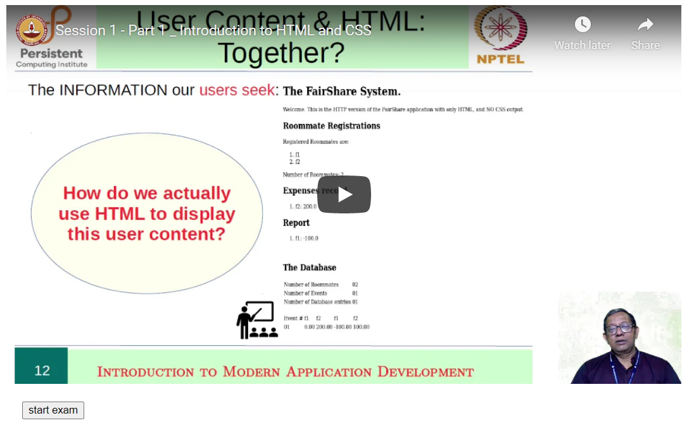

# magic-mcq-test 

<!-- [! [icon-TEXT]number] -->

**Exam in progress.** 😁 This helps you build the Interactive and responsive code for multifeature Multuple Choice Qeuestions (MCQ) test
-
---
### **How this works**
1. Initially page looks like this

2. So you start on **Start exam** button

3. When you hover on answer, it becomes pink

4. When you click on answer, it becomes red

5. Clicking on another option is allowed

6. When you click on submit

---
### **Notable Features**
When you click on option after submit, all your _previous options_ are retained 

